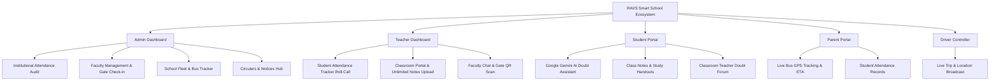

# RAVS Smart School — Complete Project Workflow & Architecture Guide

> **Official System Documentation for RAVS Smart School Management & Learning Ecosystem**  
> *Designed for PDF Export, Architecture Review, and Video Script / Pitch Presentation.*

---

## 1. Executive Summary & Vision

**RAVS Smart School** is a next-generation, cloud-integrated Smart School Management & Academic Support Ecosystem specifically tailored for **Semi-English Medium School Students (State Board & CBSE, Grades 5th to 12th)**.

In Semi-English Medium schools, Science and Mathematics are instructed in English, while concepts are explained by bridging English, Marathi, and Hindi. RAVS Smart School provides a unified multi-role digital platform for **Admins, Teachers, Students, Parents, and Bus Drivers**, powered by real-time cloud data sync and **Google Gemini AI**.

---

## 2. Core Technology Stack

- **Frontend Core**: React 18, Vite, JavaScript (ES6+)
- **Styling & UI**: Tailwind CSS, Glassmorphism, Micro-Animations, Lucide React Icons
- **Internationalization (i18n)**: `react-i18next` supporting **English, Marathi (मराठी), and Hindi (हिंदी)**
- **Cloud Backend**: Firebase (Authentication, Cloud Firestore, Cloud Functions, Cloud Storage)
- **AI Intelligence**: Google Gemini 2.0 Flash / Gemini 1.5 Flash API with intelligent offline fallback tutor
- **State & Local Persistence**: React Context API (`SchoolContext`), LocalStorage, HTML5 File & Blob APIs

---

## 3. User Roles & System Modules

---

## 4. Key Workflows & Feature Descriptions

### 🔄 Workflow 1: Student Attendance Tracker & Admin Roll-Call Sync

1. **Teacher Action**:
   - The Teacher logs into the Teacher Dashboard and clicks **Student Attendance Tracker**.
   - The teacher sees all enrolled students for their assigned class (e.g. Class 10-A).
   - The teacher marks each student as **Present**, **Absent**, or **Late** (or uses **Mark All Present** for fast entry).
   - An optional class photo proof can be attached.
   - Upon clicking **Submit Attendance**, local state updates immediately and syncs to the `attendance` Firestore collection.

2. **Admin Visibility**:
   - The Admin navigates to **Institutional Attendance**.
   - Admin views the overall campus attendance rate (e.g., 94% Present).
   - Under **Classroom Attendance Breakdowns**, the class shows **Submitted** status with exact Present/Absent totals.
   - Admin can expand any class to view the exact student roll-call list and absentee details.

---

### 🤖 Workflow 2: Google Gemini AI Academic Doubt Assistant

1. **Student Query Submission**:
   - The student opens the **AI Study Assistant** module in the Student Portal.
   - The student types any academic doubt (e.g. *"Explain photosynthesis in simple steps"* or *"Solve quadratic equation 2x² + 5x - 3 = 0"*).

2. **AI Processing Engine**:
   - The system formats the query with a Semi-English prompt context (Science & Maths in English, explanations bridging Marathi/Hindi terms).
   - Queries Google Gemini API (`gemini-2.0-flash`, `gemini-1.5-flash`).
   - If offline or API key unconfigured, the system triggers the built-in offline smart academic tutor.

3. **Structured Response Output**:
   - Output includes:
     1. **Concept Overview** (Simple English with Marathi/Hindi terms in brackets)
     2. **Step-by-Step Derivation / Explanation**
     3. **Real-World Application / Daily Life Example**
     4. **Pro Board Exam Tip** for scoring high marks.

---

### 📄 Workflow 3: Class Notes Distribution & Upload (Unlimited File Size)

1. **Teacher Publishing Notes**:
   - The Teacher opens **Classroom Portal & Notes**.
   - Selects Target Audience: **🌐 All Classes (School-Wide)** or any specific class (**Class 5A, 6A, 7A, 8A, 9A, 10A, 11A, 12A**).
   - Selects Subject, enters Title & Summary.
   - Attaches any file (PDF, Word DOCX, Image, PowerPoint, ZIP) — **Unlimited file size supported**.
   - Generates client-side Blob URL and uploads to Firebase Cloud Storage.
   - Clicks **Publish Note**.

2. **Student Access & Download**:
   - Students in the target class (or school-wide) see the note instantly in their **Study Notes & Handouts** tab.
   - Students click **Download** to open or download the complete PDF or handout file immediately.

---

### 🚌 Workflow 4: School Bus Fleet Live GPS Tracking

1. **Driver Broadcast**:
   - Driver selects bus route (e.g. Bus 1 North Route) and clicks **Start Trip**.
   - Geolocation API broadcasts live GPS coordinates to Firestore `buses` collection.

2. **Parent Real-Time Tracking**:
   - Parents open the **Bus Tracker** tab.
   - View live map, speed (km/h), current stop, and estimated time of arrival (ETA).

---

## 5. Database Schema Structure (Cloud Firestore)

| Collection | Key Fields | Purpose |
| :--- | :--- | :--- |
| `users` | `uid`, `name`, `role`, `classId`, `loginId` | User Profiles & Authentication Roles |
| `attendance` | `classId`, `students[]`, `teacherId`, `date`, `photoUrl` | Daily Class Attendance Roll-Call Records |
| `classNotes` | `title`, `subject`, `targetClassId`, `fileUrl`, `fileType`, `fileName` | Handouts, PDFs & Study Material |
| `notices` | `title`, `category`, `content`, `audience`, `createdAt` | School Circulars & Official Announcements |
| `buses` | `busNumber`, `driverName`, `status`, `lastCoordinate`, `speed` | Fleet Tracking & Live GPS Coordinates |
| `teacherAttendance` | `teacherId`, `teacherName`, `checkInTime`, `gate`, `date` | Faculty Gate QR Clock-In Audit Logs |

---

## 6. AI Video Presentation Script Outline

*Use this script outline to generate AI voiceover, presentation slides, or promotional video.*

### 🎬 Scene 1: Introduction & Product Overview (0:00 - 0:30)
- **Visual**: Smooth animation of RAVS Smart School logo with modern mobile/desktop UI preview.
- **Voiceover**: *"Welcome to RAVS Smart School — the complete digital ecosystem bridging smart administration, real-time parent connection, and AI-powered learning for Semi-English medium schools."*

### 🎬 Scene 2: Teacher Attendance Roll-Call & Admin Audit (0:30 - 1:30)
- **Visual**: Screen recording of Teacher opening Student Attendance Tracker, tapping Present/Absent, and Admin Dashboard updating instantly.
- **Voiceover**: *"With our 1-click Student Attendance Tracker, teachers take morning roll-call in seconds. Absentee records sync instantly to the Cloud, updating institutional attendance stats on the Admin Dashboard."*

### 🎬 Scene 3: Google Gemini AI Doubt Assistant (1:30 - 2:30)
- **Visual**: Student typing doubt into AI Assistant, showing live Gemini response with step-by-step steps and Board Exam Tip.
- **Voiceover**: *"Meet our Google Gemini AI Doubt Assistant. Students get instant, 24/7 academic support for physics formulas, math equations, and biology derivations — complete with State Board exam tips."*

### 🎬 Scene 4: Classroom Notes Distribution (2:30 - 3:30)
- **Visual**: Teacher selecting 'All Classes' or 'Class 10-A', attaching a PDF, and student downloading it instantly on their portal.
- **Voiceover**: *"Distributing study material is effortless. Teachers can upload unlimited PDFs, handouts, and revision notes to specific classrooms or school-wide. Students access and download notes instantly."*

### 🎬 Scene 5: Live Bus Fleet GPS Tracking (3:30 - 4:15)
- **Visual**: Parent Dashboard displaying live bus location on map with speed and ETA countdown.
- **Voiceover**: *"Parents enjoy total peace of mind with live school bus GPS tracking, route updates, and ETA notifications."*

### 🎬 Scene 6: Conclusion & Call to Action (4:15 - 4:45)
- **Visual**: Multi-device showcase (Admin, Teacher, Student, Parent) with RAVS Smart School title card.
- **Voiceover**: *"RAVS Smart School — Empowering education with AI and seamless cloud technology. Thank you."*

---
*Created automatically by Antigravity AI for RAVS Smart School Ecosystem.*
